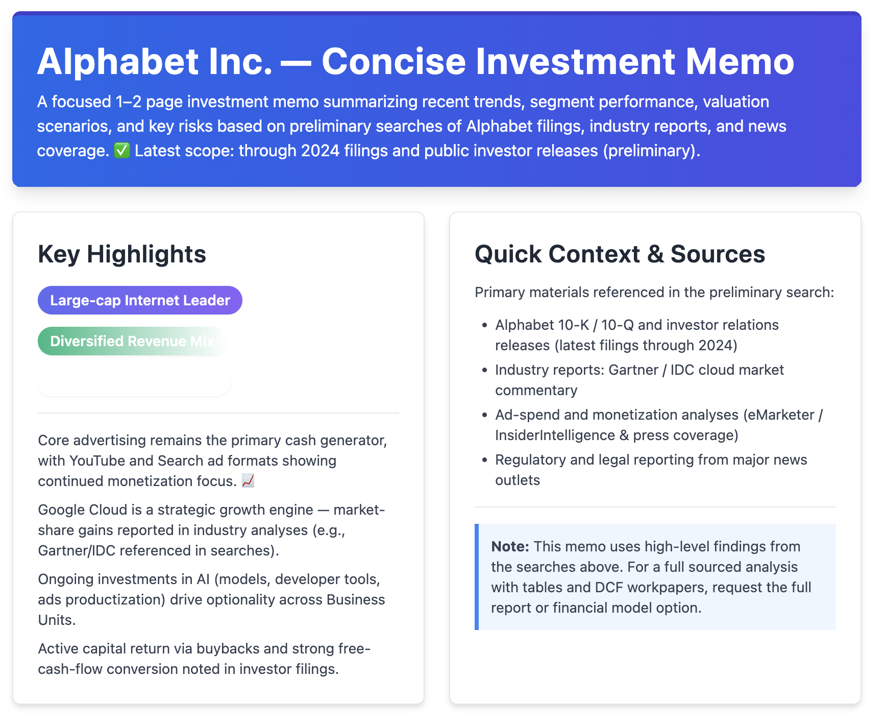

## Getting Started
1. Create a file named .env.local and add the following environment variables.
`TAVILY_API_KEY=xyz`
`OPENAI_API_KEY=xyz`

2. Run the development server:

```bash
npm run dev
# or
yarn dev
# or
pnpm dev
# or
bun dev
```

Open [http://localhost:3000](http://localhost:3000) with your browser to see the result.

3.  You can ask the agent any research related questions you have it will create a concise report for you about that subject.

example: 


4.  You can download the report by clicking the print report button, or go to http://localhost:3000/generated/research_result.html

#### Other info
This is a [Next.js](https://nextjs.org) project bootstrapped with [`create-next-app`](https://nextjs.org/docs/app/api-reference/cli/create-next-app).

This project uses [`next/font`](https://nextjs.org/docs/app/building-your-application/optimizing/fonts) to automatically optimize and load [Geist](https://vercel.com/font), a new font family for Vercel.